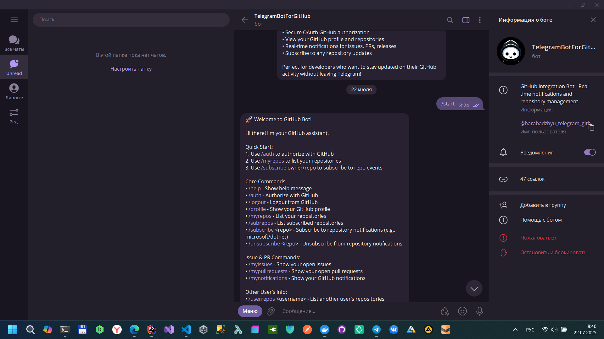
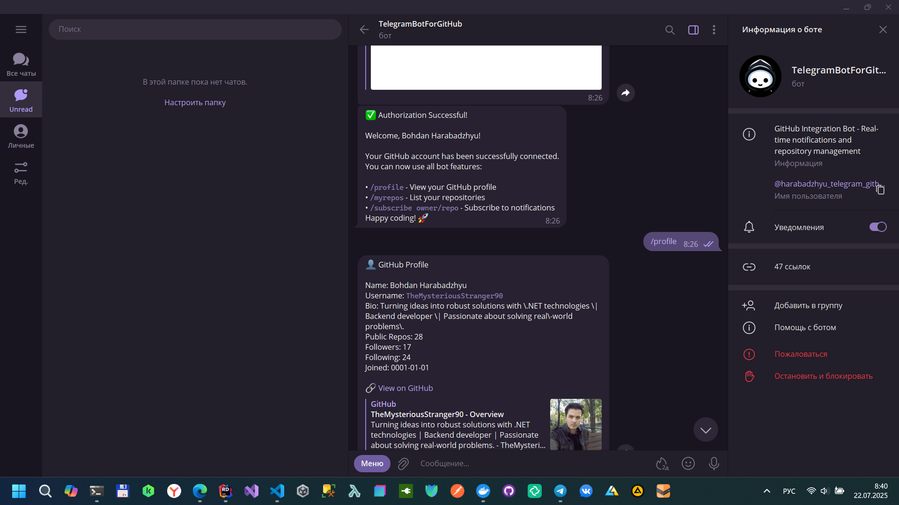
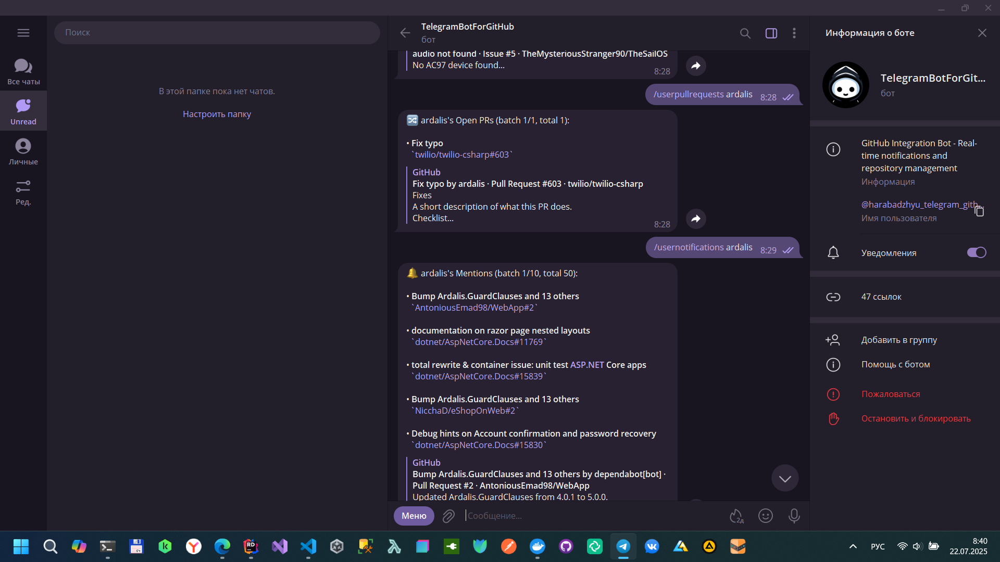
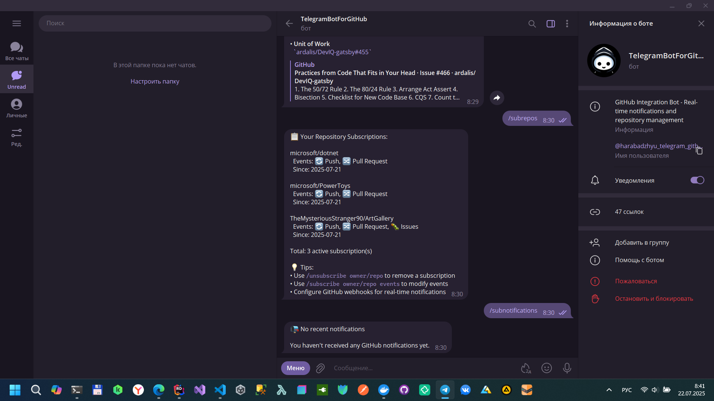
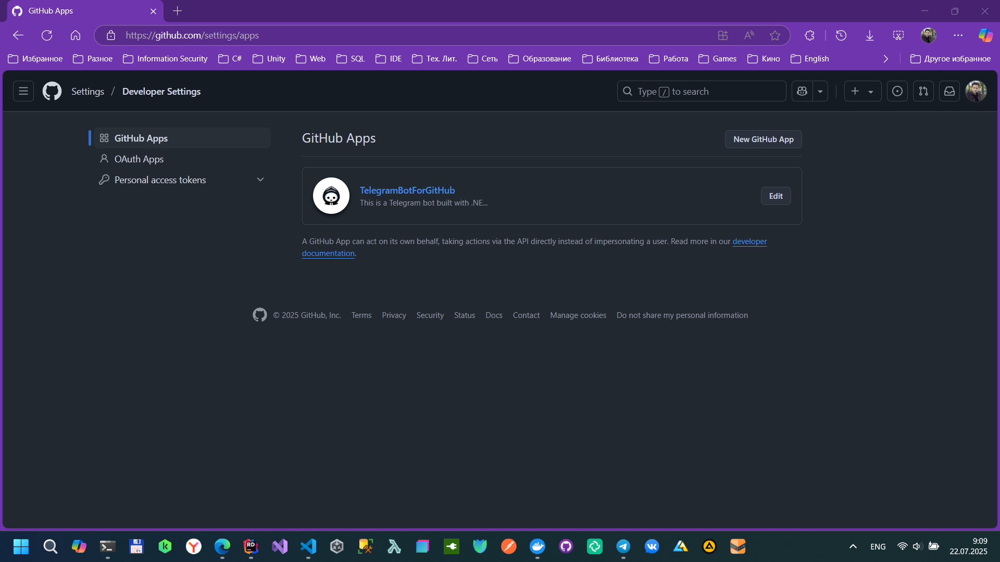

# Telegram Bot for GitHub

This is a **Telegram bot** built with **.NET 8 Azure Functions (Isolated Worker model)** that integrates with **GitHub** to provide real-time notifications, OAuth-based login, and repository interaction. It is designed for local development with **ngrok** and **Azurite** (via Docker).







## ✨ Features

- 🔐 GitHub OAuth authentication via `/auth` and `/logout`
- 👤 Profile commands like `/profile`, `/myrepos`, `/myissues`, `/mypullrequests`
- 📜 Check issues and pull requests for other users.
- 📥 Subscribe/unsubscribe to specific repositories
- 📬 Notification support for specific repositories:
   - Push events
   - Pull requests
   - Issues
- 💬 Supports GitHub webhooks and Telegram webhooks
- 💾 Azure Table Storage used for storing subscriptions

## ⚙️ Technologies

- **Backend**: .NET 8, C#
- **Framework**: Azure Functions v4 (.NET Isolated Worker)
- **Database**: Azure Table Storage
- **API Clients**:
  - `Telegram.Bot` for Telegram Bot API
  - `Octokit` for GitHub REST API
- **Tooling**:
  - **Azurite**: Local Azure Storage emulator.
  - **Ngrok**: Exposes local endpoints to the internet for webhook testing.

---

## 🚀 Getting Started (Local Development)

Follow these steps to set up and run the project on your local machine.

### Prerequisites

- [.NET 8 SDK](https://dotnet.microsoft.com/download/dotnet/8.0)
- [Docker Desktop](https://www.docker.com/products/docker-desktop/)
- [Ngrok Account & CLI](https://ngrok.com/download)
- A **Telegram Bot**. Create one by talking to [@BotFather](https://t.me/BotFather) and get your API token.
- A **GitHub OAuth App**. Create one in your GitHub settings:
  - Go to `Settings` > `Developer settings` > `OAuth Apps` > `New OAuth App`.
  - **Homepage URL**: Use your ngrok URL (e.g., `https://your-subdomain.ngrok-free.app`).
  - **Authorization callback URL**: Set it to `https://your-subdomain.ngrok-free.app/api/auth/github/callback`.

### Run Azurite Storage Emulator:
   Open a terminal and run the following Docker command to start a local Azurite instance.
```bash
docker pull mcr.microsoft.com/azure-storage/azurite
docker run -p 10000:10000 -p 10001:10001 -p 10002:10002 -v c:/azurite:/data mcr.microsoft.com/azure-storage/azurite
```

### Expose your local host with Ngrok:
   The Azure Functions project runs on port 7071 by default. Open a new terminal and run:
```bash
ngrok http 7071
```
Ngrok will give you a public Forwarding URL (e.g., https://<random-string>.ngrok-free.app). Copy this URL.

### Configure your settings:
   Create a file named local.settings.json in the root of the project. Paste the content below and fill in your own credentials.

```json
{
  "IsEncrypted": false,
  "Values": {
    "AzureWebJobsStorage": "UseDevelopmentStorage=true",
    "FUNCTIONS_WORKER_RUNTIME": "dotnet-isolated",
    "Telegram__Token": "<your-telegram-bot-token>",
    "GitHub__Token": "<your-github-token>",
    "GitHub__WebhookSecret": "<your-webhook-secret>",
    "GitHub__ClientId": "<your-github-client-id>",
    "GitHub__ClientSecret": "<your-github-client-secret>",
    "GitHub__AppId": "<your-github-app-id>",
    "GitHub__PrivateKey": "<your-github-app-private-key>",
    "GitHub__RedirectUri": "https://<your-ngrok-subdomain>.ngrok-free.app/api/auth/github/callback",
    "TableStorage__ConnectionString": "DefaultEndpointsProtocol=http;AccountName=devstoreaccount1;AccountKey=Eby8vdM02xNOcqFlqUwJPLlmEtlCDXJ1OUzFT50uSRZ6IFsuFq2UVErCz4I6tq/K1SZFPTOtr/KBHBeksoGMGw==;BlobEndpoint=http://127.0.0.1:10000/devstoreaccount1;QueueEndpoint=http://127.0.0.1:10001/devstoreaccount1;TableEndpoint=http://127.0.0.1:10002/devstoreaccount1;",
    "TableStorage__TableName": "TelegramBotData",
    "BaseUrl": "https://<your-ngrok-subdomain>.ngrok-free.app"
  },
  "Host": {
    "LocalHttpPort": 7071,
    "CORS": "*"
  }
}
```

### Run the Application:
You can run the project from your IDE (Visual Studio, Rider, VS Code) or using PowerShell script: **.bot.ps1**

## Contributing
Pull requests are welcome. For major changes, please open an issue first to discuss what you would like to change.

## Author

Bohdan Harabadzhyu

## License

[MIT](https://choosealicense.com/licenses/mit/)